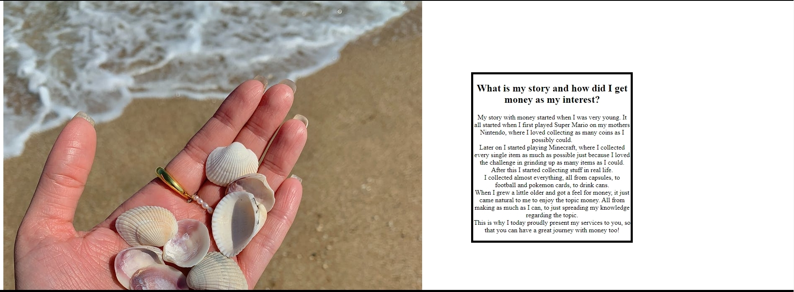
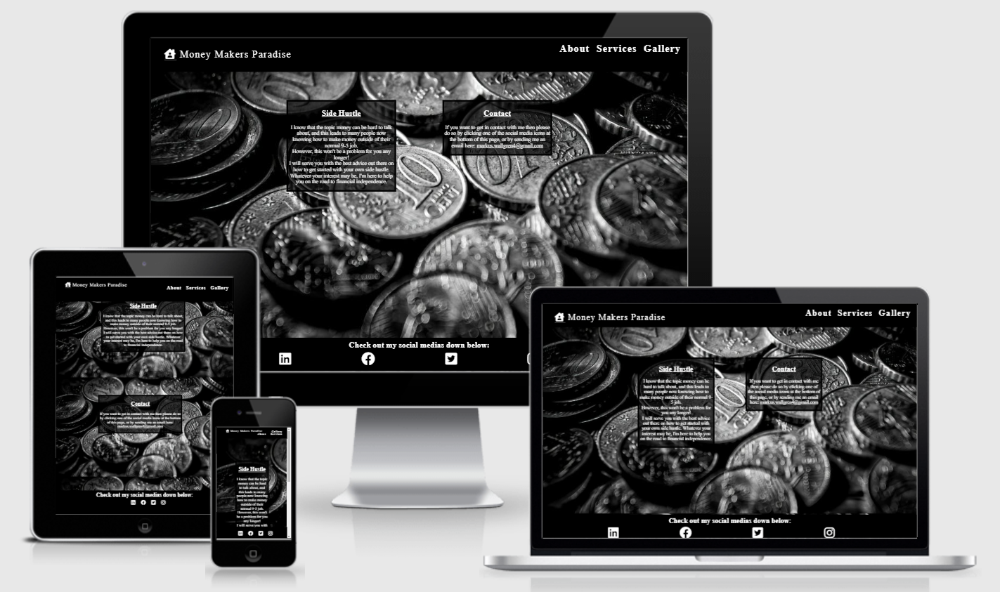
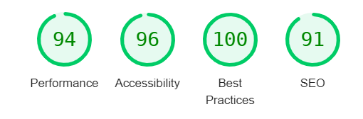
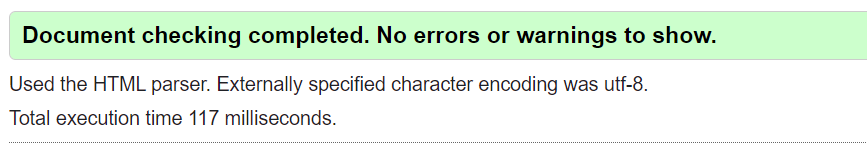
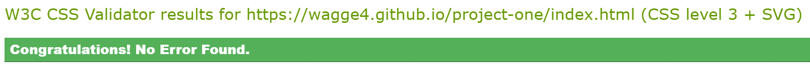

Money Makers Paradise
Money Makers Paradise is a website that is made in hopes to raise interest for the topic money.
 The site targets everyone that feel
 that they should get a better insight
 in their private economy.

 ***Features***
 **Navigation bar**
- The navigation bar is featured on all four pages of the website. This include links to the home page, about page, services page and the gallery page. The navbar is identical on each page to prevent confusion for the user.
- The navbar is made for the user to navigate between the diferrent pages easily.

**The background image**
- The background image on the index page is a black and white photo of coins. This image is matching with the theme of the page and makes for a nice background with the colors.
- On top of the background image is a little bit of text divided in two div boxes. 
The left div includes text that explains what the website is all about, while the right div includes information on how to get in contact with me. 

**The footer**
- The footer section includes links to my social medias, and the clickable links are icons as the symbol of each social media instead of boring text.
- The footer is important for me to have on a website as this makes people join me on social medias too, and not only on the website.

**About page**
- This is the page where I explain where my interest for money comes from, which makes me more trustworthy when selling my services, and it also adds a fun point of view for the user to know fun facts about me.
- The page includes one image, and one div box beside the image which includes the text that I talked about above.

**Services**
- This is the page where I explain what I can do for my users, and soon to be customers. With the use of two images and two div boxes with information where I make myself trustworthy so that they choose me and my services.

**Gallery**
- The gallery is an important page, as it shows the user that there are many different ways to make money out there, but instead of describing that to them in text form I do it using the gallery page in images.

**Features left to implement**
- When the site has grown in popularity I'm looking to make a signup page where people can sign up with a username and password, and have our own friendly community where the users can discuss ideas of their own with each other.

***Testing***

There has been a lot of testing done to the website, and it is now working as intended, after lots of bug fixing.
I faced a lot of bugs regarding GitHub. For example when I one day tried to push the save to GitHub and I got an error, and the solution to it was to restart the workspace. I thought that was a strange bug.
There was also a bug where I could not open port 8000 to see my live progress in a browser, all it said was "Failed to expose". I called the tutor for help after trying for a long time to solve it myself, both by help from Google and from my Slack friends. It turned out that it was just GitPod playing games for some reason, and all I had to do was to add "8000" to my existing URL and it worked. That was also strange to me.
Of course I had a lot of problems with missing one letter here and there, which broke the page, but that's fixed with a quick overview of the code so those problems are no big deal.

I have tested, and tested, and tested and finally I got a good responsive design that works on all devices. The website looks good on both a small phone, a little bigger tablet, a laptop and a big computer screen.

**Validator Testing**
Lighthouse Test:

- Good results in the lighthouse test using the chrom inspection</li>
HTML:
- There were no errors when testing the website using the official W3C validator.</li>

CSS:
- There were no errors when testing the website using the official Jigsaw validator.

**Deployment**
This website was deplyoed to GitHub Pages. These are the steps I used to do so:
- When in the GitHub repository you press the Settings tab
- When in the settings tab, you press "Pages" on the left side of the page.
- When you have pressed pages you click on "Branch", and after this you select main. 
- When this is done you should get a box with a green background that says the following: "Your site is published at: https://[username].github.io/[repository-name]/

The live link to my website can be found here: https://wagge4.github.io/project-one/index.html

**Credits**

I as a developer struggle to keep every line of code in my head, and this is where tutorials, other coders and helping websites come in handy.
I have used help from the following sources in my development:
[W3Schools](w3schools.com)
[StackOverflow](stackoverflow.com)
My Slack friend Eric Olsson

All the images I use are from:
[Pexels](pexels.com)

I will list each and every picture from Pexels that I have used down below:
**Background Image:** 

[https://www.pexels.com/photo/monochrome-photograph-of-coins-5364945/]

**Image on the about page:**

[https://www.pexels.com/photo/collecting-sea-shells-on-the-beach-9008501/]

**Images on the services page:** 

[https://www.pexels.com/photo/close-up-of-human-hand-327540/]
[https://www.pexels.com/photo/accountant-counting-money-210990/]

**Images in the gallery:**

[https://www.pexels.com/photo/ripple-etehereum-and-bitcoin-and-micro-sdhc-card-844124/]
[https://www.pexels.com/photo/woman-typing-on-laptop-7112/]
[https://www.pexels.com/photo/man-carrying-backpack-taking-photo-using-dslr-camera-1214566/] 
[https://www.pexels.com/photo/photo-of-man-cleaning-his-car-1740919/]
[https://www.pexels.com/photo/person-holding-mug-and-mobile-phone-6802052/]
[https://www.pexels.com/photo/people-playing-cards-7330159/]
[https://www.pexels.com/photo/person-holding-iphone-showing-social-networks-folder-607812/] 
[https://www.pexels.com/photo/internet-technology-display-business-3227986/] 
[https://www.pexels.com/photo/person-holding-sale-card-5650015/]  